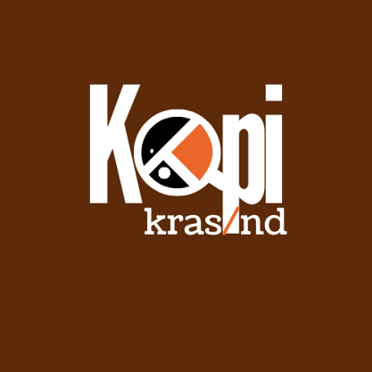

# Kopi Krasand - Coffee Shop Management System

A complete coffee shop management system with customer ordering, kitchen display, POS, inventory management, CMS, and loyalty program features.



## Features

### Customer App (`/`)
- Browse menu by category
- Add items to cart
- Place orders (dine-in, delivery, to-go)
- Automatic membership discounts at checkout
- View order history

### Admin Dashboard (`/admin`)
- User management (CRUD)
- Loyalty program management
- Membership assignment
- System statistics & revenue tracking

### CMS Dashboard (`/cms`)
- Product management (add, edit, delete)
- Category management
- Image upload
- Menu ordering/sorting
- Enable/disable products

### Kitchen Dashboard (`/kitchen`)
- Real-time order display
- Order status updates (pending → preparing → ready)
- Auto-refresh every 5 seconds

### POS Dashboard (`/pos`)
- Process payments (cash, online, QR)
- Generate receipts
- Transaction history

### Waiter Dashboard (`/waiter`)
- View order status
- Table management (seat, reserve, clear)
- Ready order notifications

### Storage Dashboard (`/storage`)
- Ingredient inventory management
- Product recipe configuration
- COGS tracking
- QR code generation for tables

## Tech Stack

- **Frontend**: React 18, TailwindCSS, Shadcn/UI
- **Backend**: FastAPI (Python 3.11)
- **Database**: MongoDB Atlas
- **Containerization**: Docker & Docker Compose

## Quick Start with Docker

### Prerequisites
- Docker & Docker Compose installed
- MongoDB Atlas account (free tier available)

### 1. Clone the repository
```bash
git clone https://github.com/yourusername/kopi-krasand.git
cd kopi-krasand
```

### 2. Configure environment
```bash
# Copy example env file
cp .env.example .env

# Edit .env with your MongoDB Atlas connection string
nano .env
```

### 3. Build and run
```bash
docker-compose up -d --build
```

### 4. Access the application
- **Customer App**: http://localhost
- **Admin Dashboard**: http://localhost/admin
- **CMS**: http://localhost/cms

## Manual Installation (Development)

### Backend Setup
```bash
cd backend

# Create virtual environment
python3 -m venv venv
source venv/bin/activate

# Install dependencies
pip install -r requirements.txt

# Create .env file
cp ../.env.example .env
# Edit .env with your MongoDB connection string

# Run server
uvicorn server:app --host 0.0.0.0 --port 8001 --reload
```

### Frontend Setup
```bash
cd frontend

# Install dependencies
yarn install

# Create .env file
echo "REACT_APP_BACKEND_URL=http://localhost:8001" > .env

# Run development server
yarn start
```

## Environment Variables

| Variable | Description | Default |
|----------|-------------|---------|
| `MONGO_URL` | MongoDB Atlas connection string | Required |
| `DB_NAME` | Database name | `kopi_krasand` |
| `SECRET_KEY` | JWT signing key | Required |
| `CORS_ORIGINS` | Allowed origins | `*` |
| `REACT_APP_BACKEND_URL` | API base URL | `http://localhost` |

## User Roles

| Role | Route | Access |
|------|-------|--------|
| Customer | `/` | Public ordering |
| Admin | `/admin`, `/cms` | Full system access |
| Cashier | `/pos` | Payment processing |
| Waiter | `/waiter` | Order & table status |
| Kitchen | `/kitchen` | Order preparation |
| Storage | `/storage` | Inventory management |

## Default Admin Account

After first deployment, create an admin user via API:

```bash
curl -X POST http://localhost/api/auth/register \
  -H "Content-Type: application/json" \
  -d '{
    "email": "admin@kopikrasand.com",
    "password": "YourSecurePassword123!",
    "name": "Admin"
  }'
```

Then update role to admin via MongoDB Atlas console or use the system's user management once logged in.

## API Documentation

Once running, access the API docs at:
- Swagger UI: http://localhost:8001/docs
- ReDoc: http://localhost:8001/redoc

## Project Structure

```
kopi-krasand/
├── backend/
│   ├── server.py          # Main FastAPI application
│   ├── requirements.txt   # Python dependencies
│   ├── Dockerfile
│   └── .env
├── frontend/
│   ├── src/
│   │   ├── components/    # Reusable UI components
│   │   ├── pages/         # Page components
│   │   ├── context/       # React context (auth)
│   │   └── utils/         # API helpers
│   ├── public/
│   │   └── images/        # Static assets
│   ├── package.json
│   ├── Dockerfile
│   └── nginx.conf
├── docker-compose.yml
├── .env.example
└── README.md
```

## Loyalty Program

The system includes a comprehensive loyalty program:

1. **Create programs** with:
   - Duration (days, months, years, lifetime)
   - Benefits (food %, beverage %, WiFi %, custom)
   - Badge colors

2. **Assign memberships** to customers

3. **Automatic discounts** applied at checkout based on membership

## License

This project is licensed under the MIT License.

---

Made with ☕ by Kopi Krasand Team
